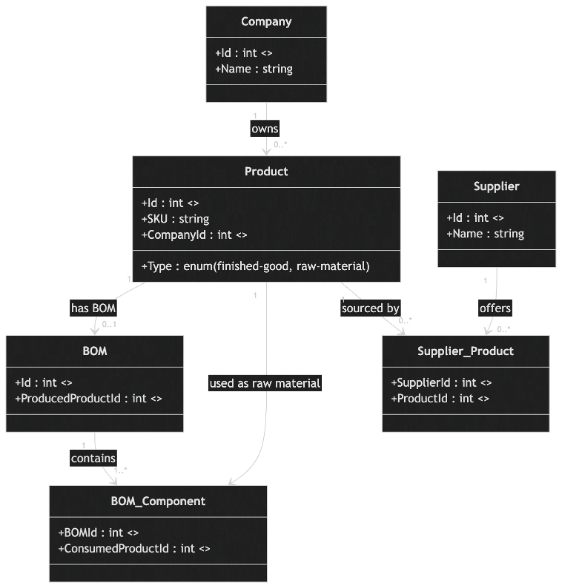

Spherecast Challenge
This document contains a bit of additional information on the structure of the data and how to interpret it.

In this drive folder you will find the db.sqlite file which contains the data to serve as the basis for the challenge described in depth in Q-Hack x Spherecast.

The database contains real companies and real products with adjusted and rather approximated BOMs and ingredients.

Background information on tables:
-	Company is the end brand that customers buy a product from (like a chocolate bar from “Mars”)
-	BOM stands for bill of materials and is the collection of the ingredients (raw materials) required to produce the finished good; every product that is a finished good has a BOM
-	Each BOM has at least 2 BOM components (= the ingredients); all of the components have the type “raw-material’
-	A supplier product shows that a certain supplier can deliver a given product; they only exist for raw materials

